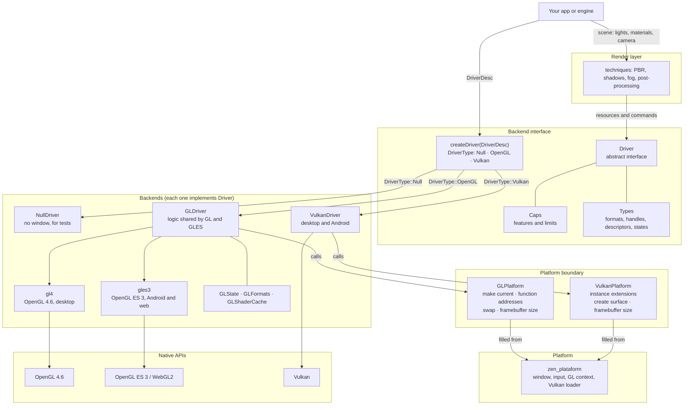

# prisma

Modern 3D renderer in C++14 for desktop, Android and web: PBR, dynamic lights, shadows, fog, HDR and bloom. Every effect can be switched on and off in code, and the minimum target is 30 fps with headroom on an integrated GPU.

Status: early work, written from scratch. Working today: the null backend and an OpenGL 4.6 backend that clears a window. The rest of this page describes the planned design; names may change.

## Architecture

Design rules:

- Each layer only knows the one below it. The renderer never sees a backend; a backend never sees a light or a material.
- Backends do not call the platform directly. They receive a `GLPlatform` or a `VulkanPlatform`, which are structs of function pointers.
- The renderer picks code paths from `Caps`, never from the backend name.
- Backend resources are handles, not objects. The classes the app uses (texture, mesh, material) live in the render layer and keep the handle inside.

## Classes

| Name | Role |
|---|---|
| `Driver` | Single interface: resources, render pass, pipeline state, draw, compute, queries |
| `createDriver` | Factory: creates the backend requested in `DriverDesc` |
| `DriverType` | `Null`, `OpenGL`, `Vulkan` |
| `Caps` | What the backend supports, and its limits |
| `Types` | Formats, resource descriptors, pipeline states |
| `BufferHandle`, `TextureHandle`, `SamplerHandle`, `ShaderHandle`, `PipelineHandle`, `RenderTargetHandle` | Backend resources: 32-bit handles (index + generation), not objects |
| `NullDriver` | Backend with no GPU, for tests |
| `GLDriver` | OpenGL backend; `gl4` on desktop, `gles3` on Android and web |
| `GLState` | Cache of the current OpenGL state |
| `GLFormats` | Format table from `Types` to OpenGL |
| `GLShaderCache` | Compiled programs and their variants |
| `VulkanDriver` | Vulkan backend |
| `GLPlatform` | OpenGL boundary: current context, function addresses, swap, size |
| `VulkanPlatform` | Vulkan boundary: instance extensions, surface creation, size |

## Backend per platform

The app requests the backend in code. A backend that is not in the binary is rejected with an error.

| Platform | Backends in the binary | The app can request |
|---|---|---|
| Desktop | `NullDriver`, `GLDriver` (gl4), `VulkanDriver` | Vulkan or OpenGL |
| Android | `NullDriver`, `GLDriver` (gles3), `VulkanDriver` | Vulkan or OpenGL |
| Web | `NullDriver`, `GLDriver` (gles3) | OpenGL only (WebGL2, no compute) |

The app gives a preference list, for example Vulkan then OpenGL. When the first backend fails to start, creation falls back to the next one.

## Dependencies

- `zen_plataform`: window, input and context.
- `containers` (`ct`): containers and utilities, used instead of the standard library.
- `math` (`mathc`): vectors, matrices, quaternions.
