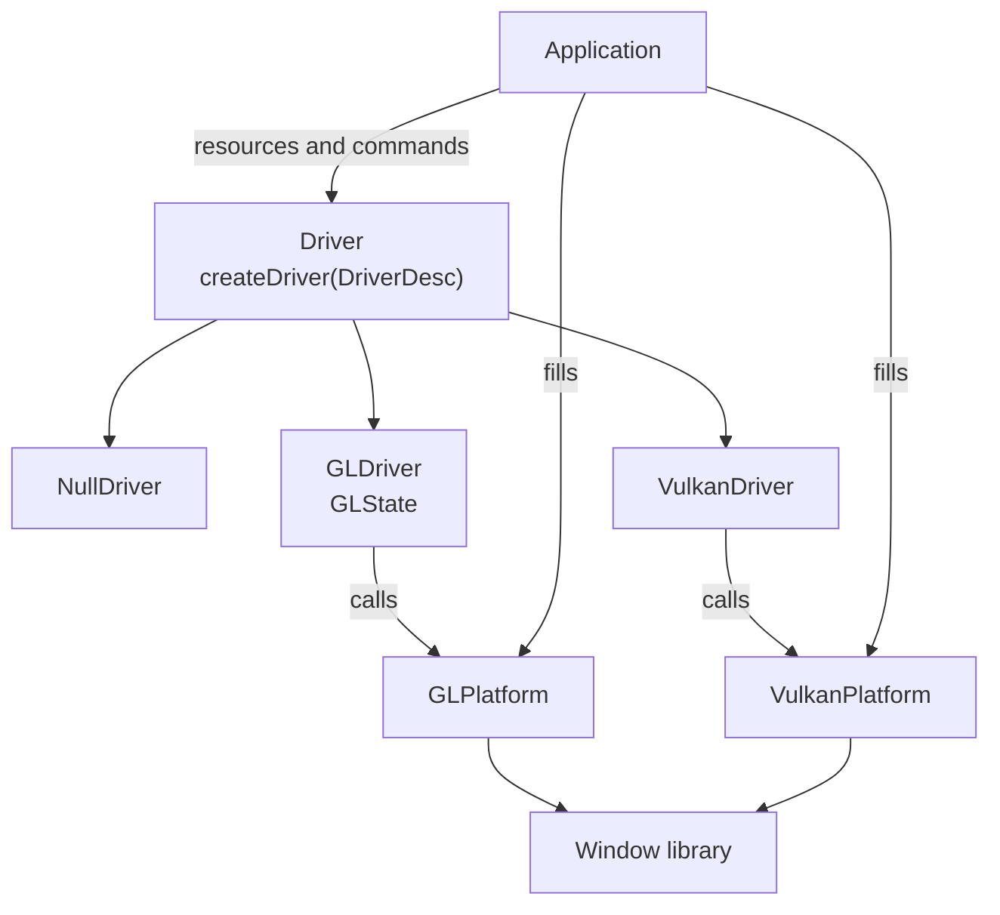

# prisma

A rendering backend library in C++14. It gives one interface over OpenGL 4.6, OpenGL ES 3 and Vulkan, and the backend is picked in code when the driver is created. It is the base for a renderer aimed at modern lighting and materials that still runs well on integrated GPUs.

## Features

- One `Driver` interface for every backend.
- Buffers (vertex, index, uniform), 2D textures, samplers, shaders and pipelines, all referenced by 32-bit handles.
- Pipelines carry depth, cull and blend state.
- Render passes with load and store operations, drawing to the window or to offscreen targets: several colour targets, depth, HDR and sRGB formats.
- Viewport and scissor with a top-left origin.
- The same conventions on every backend: clip depth from 0 to 1, linear colour with sRGB encoding on sRGB targets.
- Driver debug messages delivered to the application's log function.
- No window library inside the library: the application passes a few platform functions in a small struct.
- No exceptions, no RTTI and no standard containers.

## Backends

| Backend | Platforms | State |
|---|---|---|
| OpenGL 4.6 | desktop | working |
| OpenGL ES 3 | Android, web, desktop | working on desktop; Android and web not tested yet |
| Vulkan 1.3 | desktop, Android | in progress: device, swapchain and clear |
| Null | any | working; used by tests that need no GPU |

Only core features of each API are required. Extensions are optional and reported through `Caps`.

## Build

Requires CMake 3.21, a C++14 compiler and the OpenGL development files. The Vulkan backend is built when the Vulkan SDK is found.

```sh
git clone --recursive <repository url>
cd prisma
cmake -S . -B build
cmake --build build
ctest --test-dir build
```

| Option | Default | Meaning |
|---|---|---|
| `PRISMA_OPENGL` | `ON` | Build the OpenGL backend |
| `PRISMA_GLES` | `OFF` | Build the OpenGL backend for OpenGL ES 3 instead of OpenGL 4.6 |
| `PRISMA_VULKAN` | `ON` when Vulkan is found | Build the Vulkan backend |
| `PRISMA_BUILD_APPS` | `ON` | Build the samples |
| `PRISMA_BUILD_TESTS` | `ON` | Build the tests |

## Samples

```sh
./build/apps/clear             # a window cleared to one colour
./build/apps/triangle          # one triangle
./build/apps/cube              # a spinning textured cube
./build/apps/cube offscreen    # the cube drawn to an HDR target, then copied to the window
./build/apps/clear vulkan      # the clear sample on the Vulkan backend
```

Escape closes a sample.

## Layout

```text
libprisma/include/prisma/rhi/   public headers: Driver.h, Types.h, Caps.h
libprisma/src/prisma/rhi/       backends: gl/, vulkan/, null/
apps/                           samples
tests/                          tests
external/                       submodules
```

## Architecture



The library never calls the window library. The application fills `GLPlatform` or `VulkanPlatform` with functions from whatever it uses to open windows.

## Dependencies

| Submodule | Used by |
|---|---|
| `external/containers` | the library |
| `external/zen_plataform` | samples and tests (window and input) |
| `external/math` | samples |

## License

MIT. See [LICENSE](LICENSE).
