# prisma demos

Small programs that each show one thing the [prisma](https://github.com/akadjoker/prisma) driver can do. They run on OpenGL 4.6, OpenGL ES 3 and Vulkan: add `vulkan` to the command line for Vulkan, a number to stop after that many frames, and `still` to freeze time.

The demos that load meshes and textures read them from a media folder: set the environment variable `PRISMA_MEDIA` or the CMake option `PRISMA_MEDIA_DIR`. A demo whose feature is missing on the GPU prints a line and exits.

| | | |
|---|---|---|
|  **01 clear**<br>a window cleared to one colour | 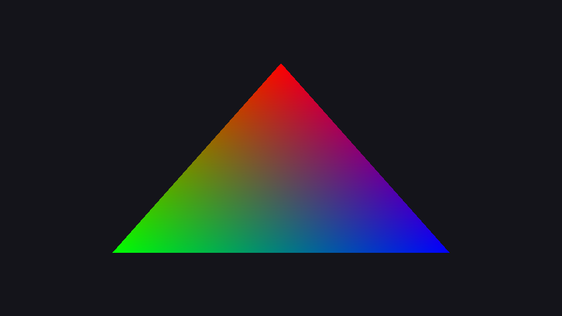 **02 triangle**<br>one coloured triangle |  **03 cube**<br>a textured cube; `offscreen` draws it to an HDR target first |
|  **04 two cubes**<br>depth testing and several draws sharing one uniform buffer |  **05 lighting**<br>two directional lights | 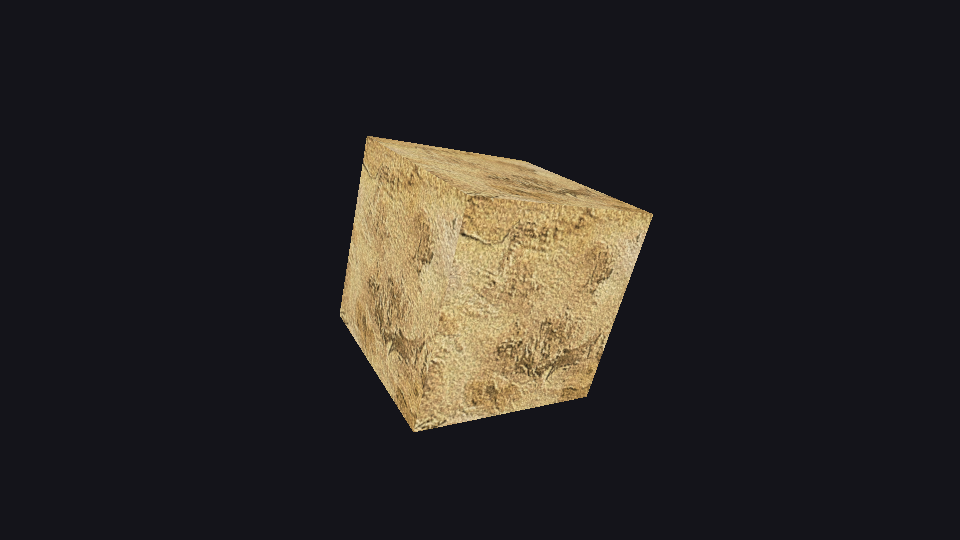 **06 texture**<br>a compressed texture with its mip chain and anisotropic filtering |
|  **07 model**<br>a mesh file with materials and textures | 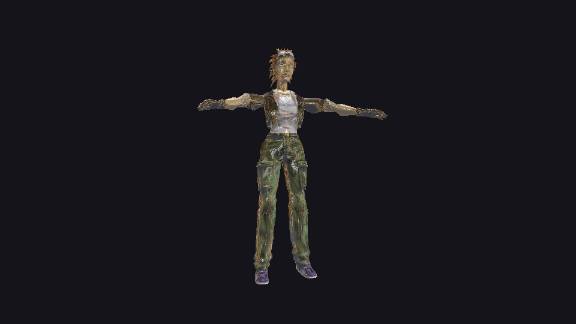 **08 reflection**<br>cube map reflection |  **09 blend and stencil**<br>blend modes and stencil masks (keys 1 to 4 and S) |
| 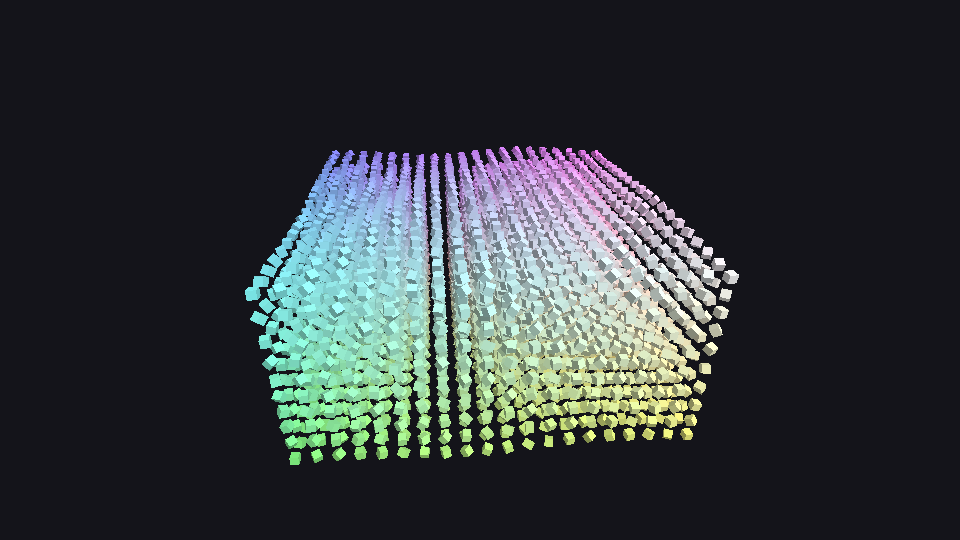 **10 instancing**<br>4000 cubes in one draw call | 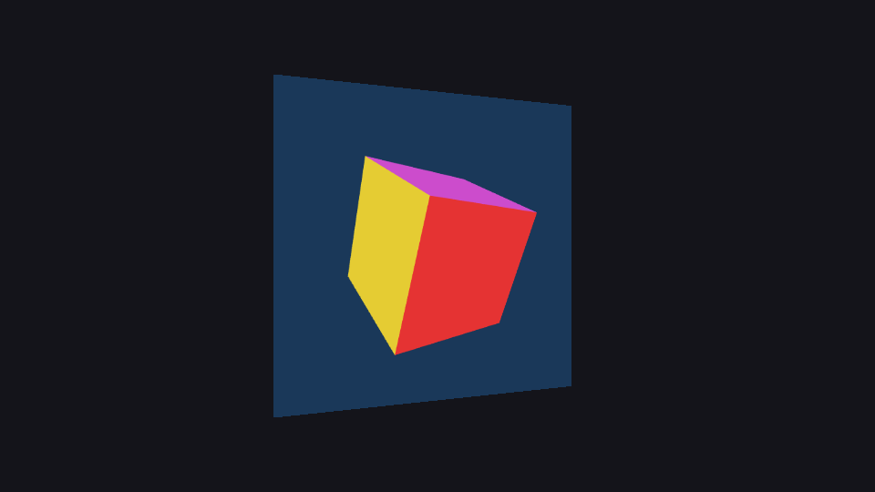 **11 offscreen msaa**<br>a multisampled offscreen target with resolve | 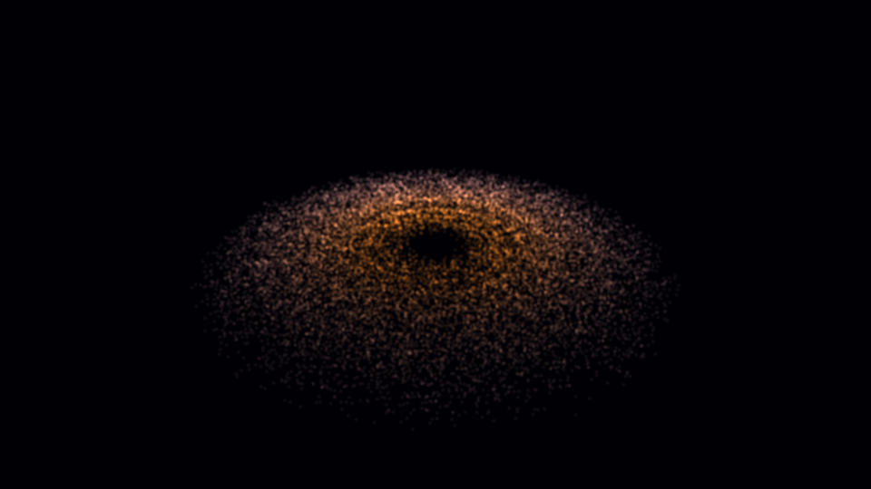 **12 particles**<br>16384 particles simulated by a compute shader |
|  **13 hdr**<br>HDR scene, bloom and tone mapping (up and down, B) |  **14 shadow map**<br>shadow mapping with a comparison sampler | 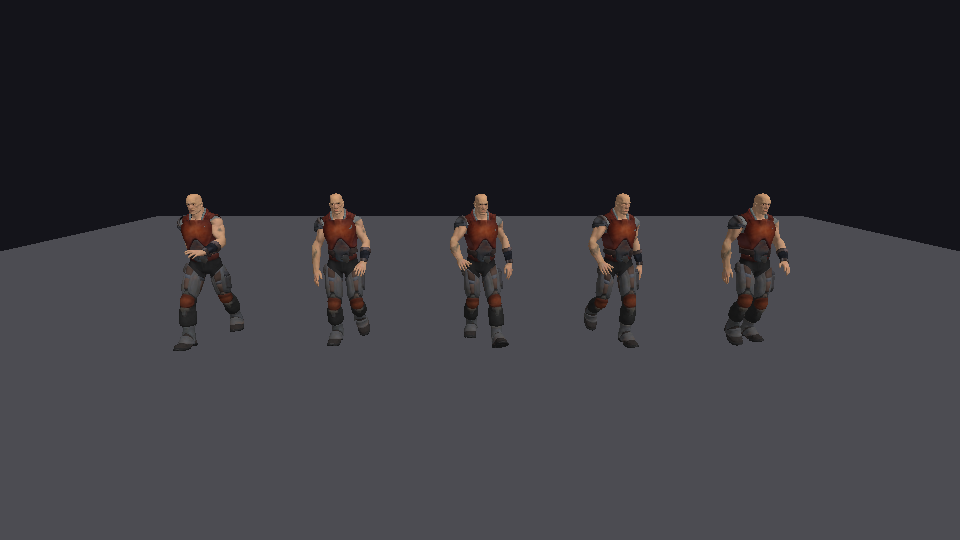 **15 soldier**<br>animated skinned characters |
|  **16 tessellation**<br>a Bezier surface on the tessellator (up and down, W) | 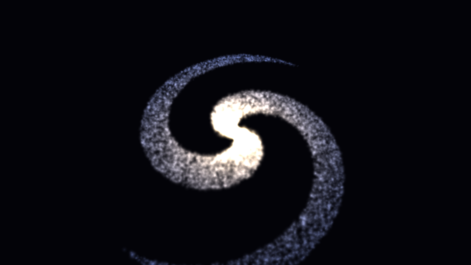 **17 point sprites**<br>a geometry shader turns points into quads | 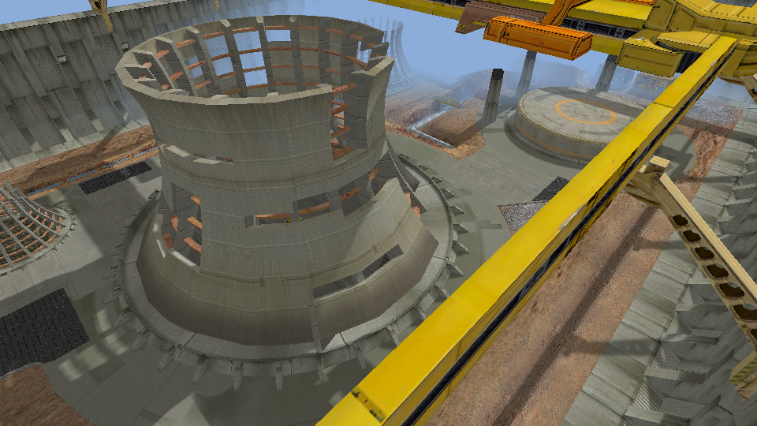 **18 cascaded shadows**<br>four shadow cascades over a power plant (C tints the cascades, T switches scene) |
| 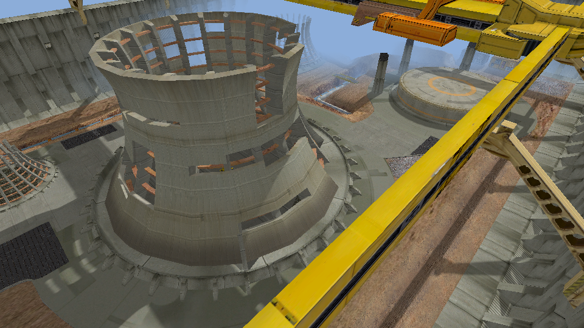 **19 variance shadows**<br>blurred depth moments and Chebyshev shadows (up and down change the blur) |  **20 contact hardening**<br>soft shadows that widen with distance from the caster (up and down change the light size) |  **21 pn triangles**<br>curved PN triangles on the tessellator (up and down, W, P) |
|  **22 displacement**<br>displacement mapping with crack-free tessellation levels (up and down, W) | 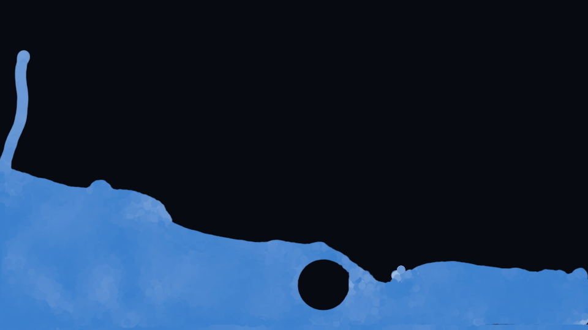 **23 fluid**<br>a 2D smoothed-particle hydrodynamics fluid in compute shaders | 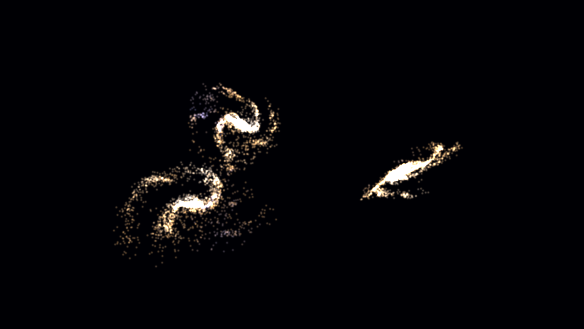 **24 n-body**<br>8192 bodies attracting each other, shared-memory tiles in compute |
|  **25 oit**<br>order-independent transparency with per-pixel linked lists (O toggles) | 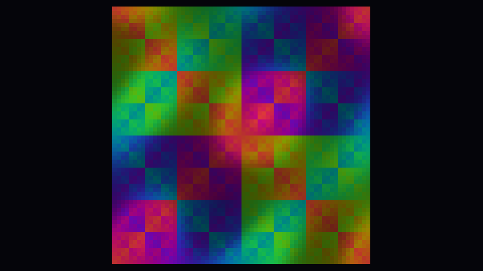 **26 basic compute**<br>a compute shader adds two buffers, the result is read back and checked on the CPU, then drawn as a grid | 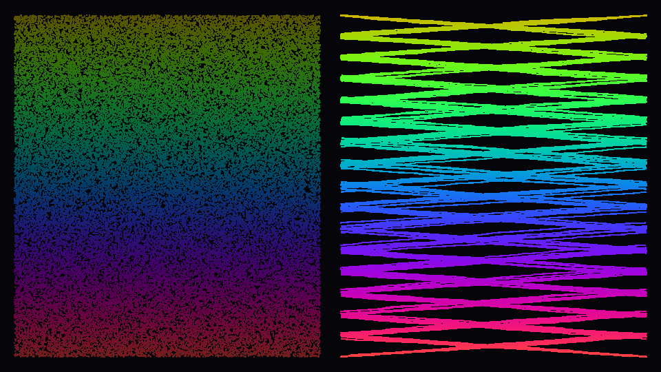 **27 compute sort**<br>bitonic sort of 65536 values in shared memory, one dispatch per step, checked against the CPU sort |
|  **28 shadow volume**<br>stencil shadow volumes: silhouette edges extruded away from an orbiting light in the vertex shader, counted with a two-sided depth-fail stencil (T shows the volume) |  **29 hdr tonemap compute**<br>HDR scene with auto exposure in compute shaders: log-luminance reduction in shared memory, time-based adaptation kept on the GPU, bright pass and separable blur into storage images, then a tone-mapping pass (L cycles the scene brightness, B toggles bloom; `dark` and `bright` start at that level) | 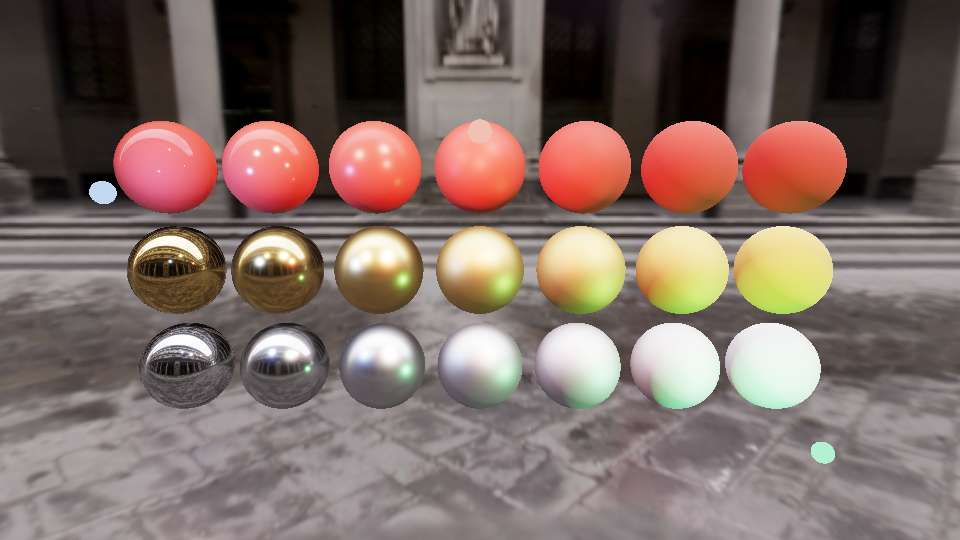 **30 pbr ibl**<br>physically based spheres lit by an environment probe (SH irradiance, GPU-prefiltered specular, BRDF table) and by a sun, point lights, a spot and 48 small lights culled into a froxel grid (L toggles the lights; `grace`, `stpeters`, `galileo` and `rnl` pick another probe) |  **31 gltf viewer**<br>glTF 2.0 viewer on the PBR shaders: metal-roughness and specular-glossiness materials, normal, occlusion and emissive maps, alpha modes, culling and sorting (`model=path` opens another file) |
| 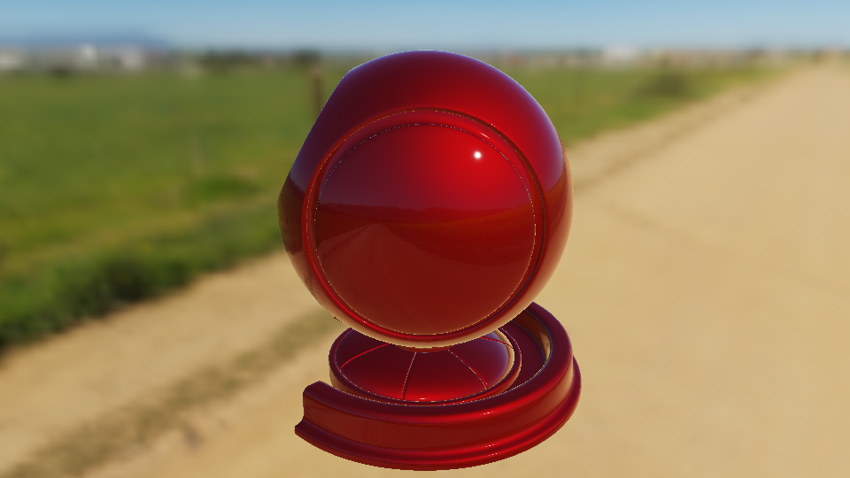 **32 ibl clear coat**<br>the shader ball with a clear coat over a metallic red base, lit by an equirectangular HDR (`env=file.hdr`) and a 110000 lux sun, exposed at f/16, 1/125 s, ISO 100 (`blur=` sets how blurred the background is, `model=` loads another OBJ or glTF path) | | |
| 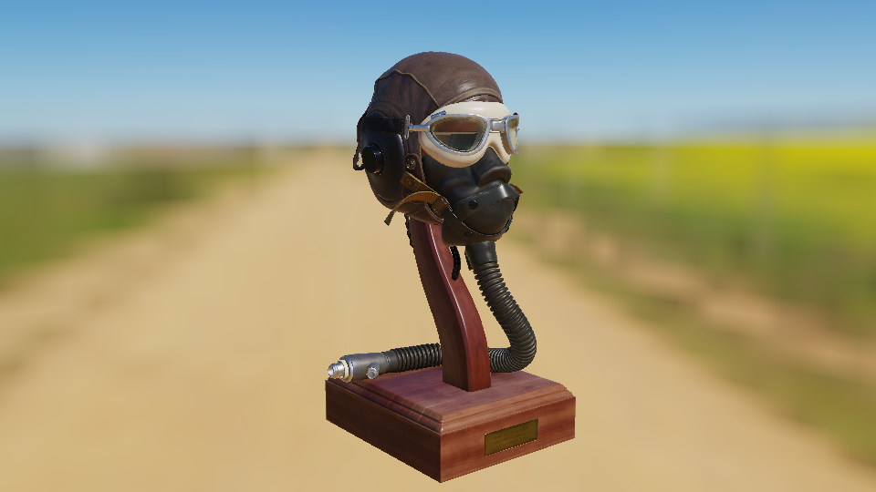 **33 flight helmet**<br>the FlightHelmet glTF (leather, rubber, wood, metal and glass with colour, normal and occlusion-roughness-metal maps, the lenses blended) lit by the equirectangular HDR of a flower road without its sun, a 110000 lux sun that follows the camera and the f/16 exposure of demo 32; the model has to be converted first with `gltf_undraco` (`model=path.gltf`, default `models/FlightHelmet/FlightHelmet.gltf`), `env=` picks the HDR, `blur=` the background blur, `yaw=` the start angle of the camera, `turn=` the turn of the model and `ev=` stops of exposure added | | |
| 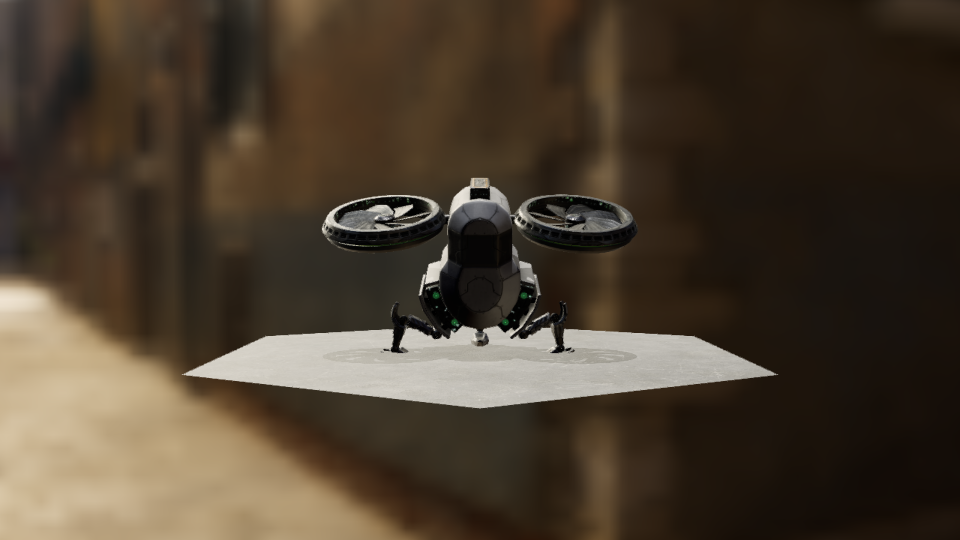 **34 drone**<br>the Buster drone glTF (converted without Draco with `gltf_undraco`) lit by the Venetian crossroads HDR (`env=file.hdr`) and a 100000 lux sun straight above, drawn into a 1280x720 HDR target that never changes size and shown on the window through a full screen pass with the ACES legacy tone mapper, with the bloom of the reference (a thresholded downsample chain of six levels added back with `bloom=` strength, 0.10 by default, 0 turns it off), the shadow of the sun (an orthographic map fitted to the model, `shadowsize=` 2048 by default, `normalbias=`) FXAA on the tone mapped picture (`fxaa=0` turns it off) and so resizing the window only stretches the quad (`model=`, `blur=`, `yaw=`, `height=`, `ev=`) | | |

## Running every demo

`demos/run_all.sh [build-dir] [frames] [backend]` configures the build directory if it does not exist, builds everything and runs each demo for the given number of frames (default 120, backend `vulkan` or empty for OpenGL); it prints a summary and exits with an error if any demo failed. Pointed at the windowless build described below it runs without opening any window.

## Screenshots without a window

The pictures above are taken by the demos themselves, with no window system: configure a tree whose window library is a stub and whose driver draws into an off-screen surface on the real GPU, then run the script.

```sh
cmake -S . -B build-shots -DPRISMA_HEADLESS_DEMOS=ON -DPRISMA_BUILD_TESTS=OFF
cmake --build build-shots
./demos/shots.sh build-shots demos/images
```

Any demo also saves a picture of the frame it is drawing when `PRISMA_SHOT=file.png` is set (and `PRISMA_SHOT_FRAME=n` picks the frame), in a normal window build too.
